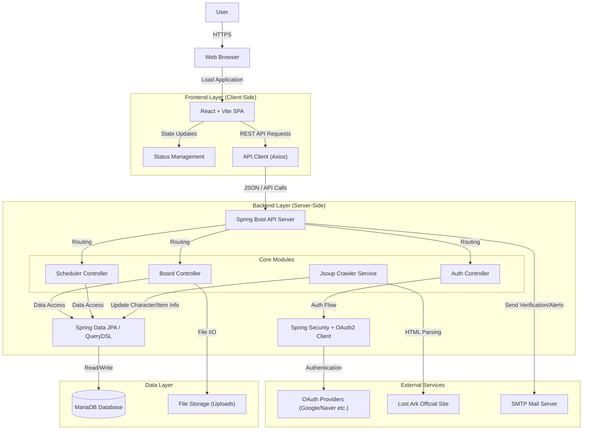

```mermaid
graph TD
%% ==========================
%% Client & Frontend
%% ==========================
User[User] -->|HTTPS| Browser["Web Browser"]

    subgraph "Frontend Layer (Client-Side)"
        ReactApp["React + Vite SPA"]
        StateStore["Status Management"]
        Axios["API Client (Axios)"]
    end

    Browser -->|Load Application| ReactApp
    ReactApp -->|State Updates| StateStore
    ReactApp -->|REST API Requests| Axios

    %% ==========================
    %% Backend
    %% ==========================
    subgraph "Backend Layer (Server-Side)"
        SpringBoot["Spring Boot API Server"]

        subgraph "Core Modules"
            AuthController["Auth Controller"]
            BoardController["Board Controller"]
            TaskController["Scheduler Controller"]
            CrawlerService["Jsoup Crawler Service"]
        end

        Security["Spring Security + OAuth2 Client"]
        JPA["Spring Data JPA / QueryDSL"]
    end

    Axios -->|JSON / API Calls| SpringBoot

    SpringBoot -->|Routing| AuthController
    SpringBoot -->|Routing| BoardController
    SpringBoot -->|Routing| TaskController

    AuthController -->|Auth Flow| Security
    BoardController -->|Data Access| JPA
    TaskController -->|Data Access| JPA

    %% ==========================
    %% Data & Infrastructure
    %% ==========================
    subgraph "Data Layer"
        MariaDB[("MariaDB Database")]
        FileSystem["File Storage (Uploads)"]
    end

    JPA -->|Read/Write| MariaDB
    BoardController -->|File I/O| FileSystem

    %% ==========================
    %% External Services
    %% ==========================
    subgraph "External Services"
        OAuthProvider["OAuth Providers (Google/Naver etc.)"]
        LoaOfficial["Lost Ark Official Site"]
        MailServer["SMTP Mail Server"]
    end

    Security -->|Authentication| OAuthProvider
    CrawlerService -->|HTML Parsing| LoaOfficial
    CrawlerService -->|Update Character/Item Info| JPA
    SpringBoot -->|Send Verification/Alerts| MailServer
```
