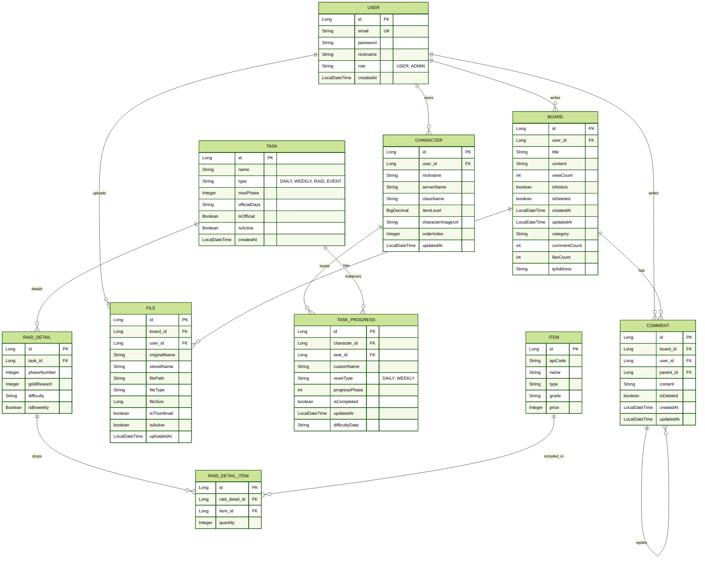

```mermaid
---
config:
  layout: dagre
  theme: forest
---
erDiagram
	direction TB

    %% ==========================================
    %% 1. USER & CHARACTER (Core)
    %% ==========================================
	USER {
		Long id PK
		String email UK
		String password
		String nickname
		String role "USER, ADMIN"
		LocalDateTime createdAt
	}

	CHARACTER {
		Long id PK
		Long user_id FK
		String nickname
		String serverName
		String className
		BigDecimal itemLevel
		String characterImageUrl
		Integer orderIndex
		LocalDateTime updatedAt
	}

    USER ||--o{ CHARACTER : owns

    %% ==========================================
    %% 2. BOARD SYSTEM (Right Wing)
    %% ==========================================
	BOARD {
		Long id PK
		Long user_id FK
		String title
		String content
		int viewCount
		boolean isNotice
		boolean isDeleted
		LocalDateTime createdAt
		LocalDateTime updatedAt
		String category
		int commentCount
		int likeCount
		String ipAddress
	}

	COMMENT {
		Long id PK
		Long board_id FK
		Long user_id FK
		Long parent_id FK
		String content
		boolean isDeleted
		LocalDateTime createdAt
		LocalDateTime updatedAt
	}

	FILE {
		Long id PK
		Long board_id FK
		Long user_id FK
		String originalName
		String storedName
		String filePath
		String fileType
		Long fileSize
		boolean isThumbnail
		boolean isActive
		LocalDateTime uploadedAt
	}

    USER ||--o{ BOARD : writes
    USER ||--o{ COMMENT : writes
    USER ||--o{ FILE : uploads
    BOARD ||--o{ COMMENT : has
    BOARD ||--o{ FILE : has
    COMMENT ||--o{ COMMENT : replies

    %% ==========================================
    %% 3. SCHEDULER SYSTEM (Left Wing)
    %% ==========================================
	TASK {
		Long id PK
		String name
		String type "DAILY, WEEKLY, RAID, EVENT"
		Integer maxPhase
		String officialDays
		Boolean isOfficial
		Boolean isActive
		LocalDateTime createdAt
	}

	TASK_PROGRESS {
		Long id PK
		Long character_id FK
		Long task_id FK
		String customName
		String resetType "DAILY, WEEKLY"
		int progressPhase
		boolean isCompleted
		LocalDateTime updatedAt
		String difficultyData
	}

    CHARACTER ||--o{ TASK_PROGRESS : tracks
    TASK ||--o{ TASK_PROGRESS : instances

    %% ==========================================
    %% 4. RAID INFO (Deep Detail)
    %% ==========================================
	RAID_DETAIL {
		Long id PK
		Long task_id FK
		Integer phaseNumber
		Integer goldReward
		String difficulty
		Boolean isBiweekly
	}

	ITEM {
		Long id PK
		String apiCode
		String name
		String type
		String grade
		Integer price
	}

	RAID_DETAIL_ITEM {
		Long id PK
		Long raid_detail_id FK
		Long item_id FK
		Integer quantity
	}

    TASK ||--o{ RAID_DETAIL : details
    RAID_DETAIL ||--o{ RAID_DETAIL_ITEM : drops
    ITEM ||--o{ RAID_DETAIL_ITEM : included_in
```
